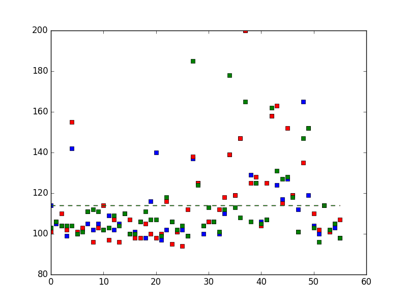
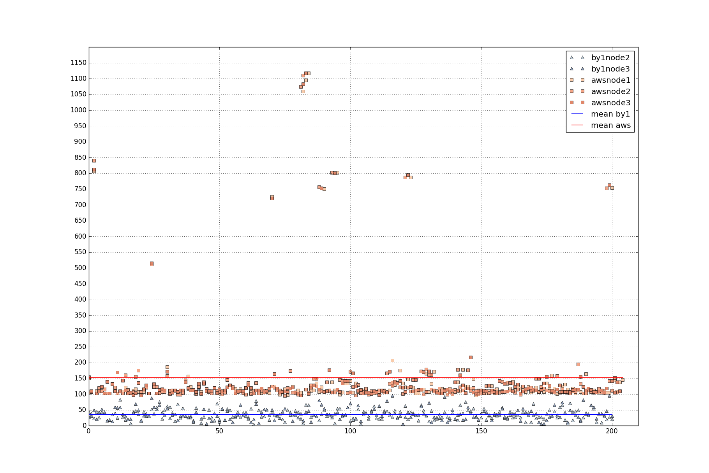
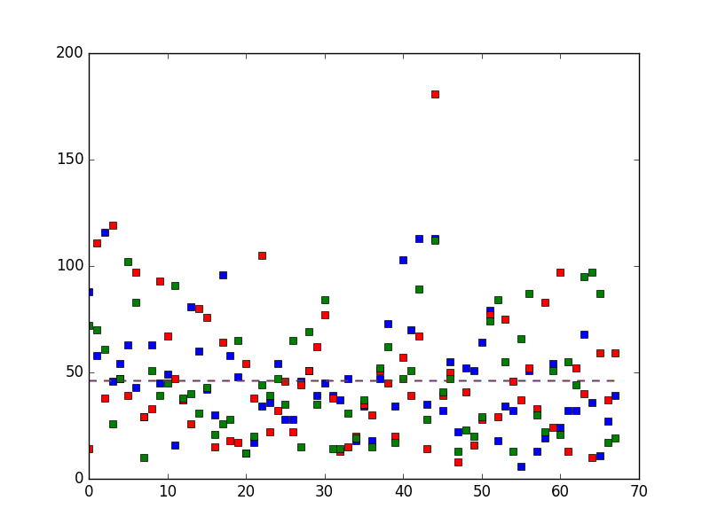
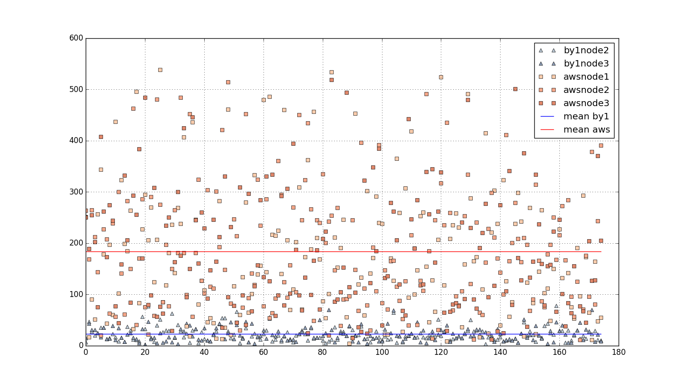
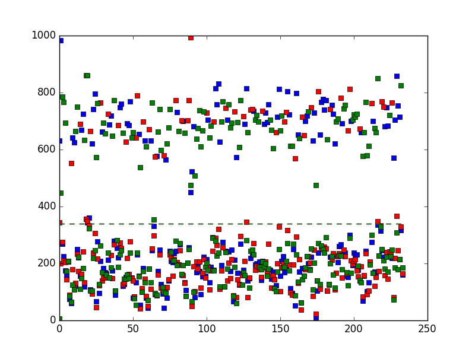

# What's this?
These scripts can be used to test replication latency in a multi-region Cassandra cluster

# Installation
## Installation of python drivers for Cassandra
To run the test scripts we have to execute the following commands
```
# apt update
# apt install python-pip
# pip install cassandra-driver
```
## Preparing the tables
To create the test tables, run the `create-test-tables.cql` on your cluster

## Running python clients on various parts of cluster
Start one writer in one local node, with the following parameters
```
$ python ./cassandra-tester-writer.py LOCAL_ADDRESS_OF_THE_NODE USERNAME PASSWORD NUMBER_OF_READERS
```
Start readers at the other end of the globe with the following parameters
```
$ python ./cassandra-tester-reader.py LOCAL_ADDRESS_OF_THE_NODE USERNAME PASSWORD
```
Output will show measured replication latency on each node

# Restarting the tests
Before restarting the tests, you need to truncate all the tables
```SQL
CONSISTENCY ALL
TRUNCATE replicated.test;
TRUNCATE replicated.test_count;
```

# Running tests on real servers
We have 3 nodes in Belarus and 3 nodes in Asia Pacific (Tokyo). The latency between the two locations are the following
**TBD Global map**

```
$ traceroute -T -p 7000 ...
15 ec2-...ap-northeast-1.compute.amazonaws.com (...)  198.325 ms  205.944 ms  206.179 ms
15 ec2-...ap-northeast-1.compute.amazonaws.com (...)  198.464 ms  205.289 ms  197.268 ms
15  ec2-...ap-northeast-1.compute.amazonaws.com (...)  196.553 ms  197.667 ms  197.117 ms
15  ec2-...ap-northeast-1.compute.amazonaws.com (...)  201.749 ms  203.529 ms  203.689 ms
15  ec2-...ap-northeast-1.compute.amazonaws.com (...)  1403.528 ms  210.139 ms  203.983 ms
15  ec2-...ap-northeast-1.compute.amazonaws.com (...)  203.817 ms  201.101 ms  199.461 ms
15  ec2-...ap-northeast-1.compute.amazonaws.com (...)  197.795 ms  195.290 ms  197.727 ms
15  ec2-...ap-northeast-1.compute.amazonaws.com (...)  208.103 ms  207.926 ms  206.635 ms
```

# NTP Sync
When running on real servers, you have to set-up NTP sync between them, or you'll measurements won't be accurate. For example our [real severs](#running-tests-on-real-servers) show around **115 ms** latency without any NTP configuration.

## Installing NTP
```
sudo yum install ntp
```

## Setting up common NTP server
```
# vi /etc/ntp.conf
```
**TBD**

## Checking the settings
```
# ntpstat
# ntpq -p
```

## Related links
[https://en.wikipedia.org/wiki/Network_Time_Protocol#Clock_synchronization_algorithm]
[http://docs.aws.amazon.com/AWSEC2/latest/UserGuide/set-time.html]
[http://www.ntp.org/ntpfaq/NTP-a-faq.htm]

# Test results after NTP sync
We've set NTPd to use the same server for synchronization. `ntpstat` gave us the following results after one day of continuous synchronization.
```
[oresztesz_margaritisz@epam.com@... ~]$ ntpstat
synchronised to NTP server (117.102.176.202) at stratum 3
   time correct to within 169 ms
   polling server every 1024 s
```
```
[oresztesz_margaritisz@epam.com@... ~]$ ntpstat
synchronised to NTP server (117.102.176.202) at stratum 3
   time correct to within 180 ms
   polling server every 1024 s
```
```
[cassandra@... bin]$ ntpstat
synchronised to NTP server (117.102.176.202) at stratum 3
   time correct to within 135 ms
   polling server every 1024 s
```
```
[ec2-user@... ~]$ ntpstat
synchronised to NTP server (117.102.176.202) at stratum 3
   time correct to within 96 ms
   polling server every 1024 s
```
```
[ec2-user@... ~]$ ntpstat
synchronised to NTP server (117.102.176.202) at stratum 3
   time correct to within 80 ms
   polling server every 1024 s
```
```
[ec2-user@... ~]$ ntpstat
synchronised to NTP server (117.102.176.202) at stratum 3
   time correct to within 50 ms
   polling server every 1024 s
```
Comparing the time correctness with the [network latency between the nodes](#running-tests-on-real-servers) reveals, that the results won't give us the answer precisely. But it can be good enough for an approximation.


# Running tests in simulation
The scripts were tested with boot2docker on Windows. Note how widespread are the measured results. This wide distribution of latency can't be found, when running the tests on the [real servers](#test-results-after-ntp-sync).

## Setting up and starting containers
Use the `create-cluster.sh` bash script to setup your cluster with docker
You have to start the nodes manually if they failed to start up properly.
```
docker start by1node3
```

## Adding delays to WAN network on AWS nodes
```
docker exec -ti --privileged awsnode1 tc qdisc add dev eth1 root netem delay 25ms
docker exec -ti --privileged awsnode1 tc qdisc show
```

## Speeding up again
```
docker exec -ti --privileged awsnode1 tc qdisc del dev eth0 root netem
```

## Adding delays to all of the AWS instances
```
# add-delay.sh 250ms
```

## Checking cluster status
```
docker exec by1node1 nodetool status
```

## Destroying all containers
```
docker ps -qa | xargs docker rm -f
```

## Running the tests
Start on by1node1
```
python ./writer.py 192.168.1.10 cassandra cassandra 3
```
Start on awsnode1
```
python ./reader.py 192.168.2.10 cassandra cassandra
```
Start on awsnode2
```
python ./reader.py 192.168.2.11 cassandra cassandra
```
Start on awsnode3
```
python ./reader.py 192.168.2.12 cassandra cassandra
```
# Results in simulation (no delay configured)


# Results in simulation (250ms delay)


# Results in simulation (500ms delay)


# How it works?
**TBD**
